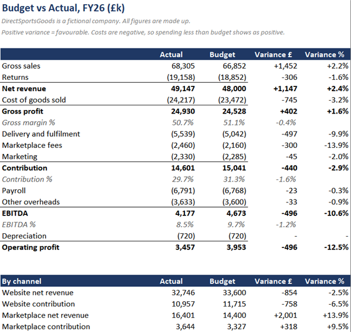

# DirectSportsGoods: a working finance function

> **DirectSportsGoods is a fictional company and every figure in this repo is made up.** The ratios behind it are calibrated on the published accounts of Frasers Group and Debenhams Group (formerly boohoo), with page references in [`docs/assumptions.md`](docs/assumptions.md).

A finance function for a made-up UK online sports retailer with about £48m of sales, built in four stages. Each stage works on its own.

| Stage | What it shows | Status |
|-------|---------------|--------|
| P1 | Management pack: P&L, budget vs actual, KPIs, cash and variance commentary | Done |
| P2 | Month-end close: messy raw data, a general ledger, checks that catch planted errors | Done |
| P3 | Rolling 18-month forecast with scenarios, and a two-page CFO memo | Done |
| P4 | First acquisition: two targets through due diligence, one rejected, one bought | Done |



## P1: FY26 management pack

### Problem

DirectSportsGoods sells sports kit online, through its own website and through third-party marketplaces. In the year to 31 January 2026 it beat its sales budget by £1.1m and still missed operating profit by £517k. The question for the board: why, and what should change before next Christmas?

### Approach

- Built a monthly budget and actuals for each channel from operating drivers: orders, average order value, returns, gross margin, delivery cost per order, marketplace fees and marketing.
- Calibrated those drivers on real companies. Gross margin (51.1%), payroll ratio, stock days, creditor days and the half-year sales split come from Frasers Group's FY26 accounts. Returns rate (28.2%) and delivery cost per order (£4.20) come from Debenhams Group's FY26 accounts, and marketplace fees (15%) from Amazon UK's published seller fees.
- Laid the pack out for a finance team to use: a P&L that switches between channels and between actual, budget and last year, a budget vs actual page, KPIs, a cash page and written commentary.
- Every page reads from one data tab through SUMIFS formulas, so a change to the data flows through the whole pack.
- The workbook is generated by a Python script, written with AI assistance, that uses a fixed random seed, so it rebuilds identically every time.

### Result

Growth came from the lower-margin channel, and each order cost more to deliver.

1. **Marketplace sales were £2.0m ahead of budget** after a wider range went live in June. Marketplace sales earn 22% contribution against 30% on the website, so the extra £2.0m added only £318k.
2. **Website sales were £854k behind**, £619k of it over Black Friday and Christmas, even with an extra £93k of paid search in November. Website contribution fell £779k, more than the whole profit gap.
3. **Delivery cost £497k more than budget.** £319k of that is a carrier price rise in September, which carries into next year.

The commentary page sets out what to do about each one. Cash rose from £4.0m to £5.5m over the year, after £558k of corporation tax paid in quarterly instalments.

## P2: Month-end close

### Problem

The P1 pack started from clean monthly figures. A real close starts from exports that don't agree with each other: duplicate invoices, costs coded to the wrong account, invoices that land in the wrong month. Can the close find them, fix them, and still end up with numbers the board can trust?

### Approach

- Generated three years of raw data (FY24 to FY26): daily website and marketplace sales, 1,352 supplier invoices, payroll, stock dispatches and 2,485 bank lines. The supplier invoice export is messy on purpose, with supplier names spelled several ways, mixed date formats and amounts stored as text.
- Planted 39 errors (duplicate invoices, miscoded costs, missed accruals, marketplace fee overcharges) and 6 decoys: correct entries that look wrong. All of them are logged in an answer key the checks never see.
- Cleaned the data in Python, posted it to a general ledger in SQLite, and wrote the checks and the correcting journals in SQL.
- Scored the checks against the answer key afterwards.

### Result

- **37 of 39 errors caught, 1 false alarm, 5 of 6 decoys rightly left alone.**
- The 2 misses were stock invoices a supplier re-sent under new numbers, 19 and 27 days after the originals. The duplicate check only matches re-sent invoices within 14 days, because a wider window starts flagging regular monthly charges. Both still showed up in the aged creditors review.
- The false alarm was an invoice coded correctly but with no approval note. The fix is process: require an approval note on any recode.
- After corrections, the ledger reproduces the P1 pack to the penny for every month and every line. Before corrections, FY26 operating profit was understated by £118k.

Full detail in [`docs/close_report.md`](docs/close_report.md).

## P3: Rolling forecast and CFO memo

### Problem

The carrier's September price rise is permanent. What does the next 18 months look like, and what should the business do about delivery costs?

### Approach

- Built a driver-based forecast from February 2026 to July 2027. Sales are orders × average order value × returns by channel, rolled forward from the same month last year. Warehouse payroll is orders ÷ orders per hour × the National Living Wage (£12.71 from April 2026, from gov.uk), with productivity calibrated on FY26.
- Three scenarios on one input sheet, switched by a dropdown. Every forecast cell is a live formula.
- Costed three responses to the price rise against doing nothing: switch carrier, add a delivery charge on small orders, or raise prices 2%. Each one is shown in all three scenarios with a break-even point, so the case doesn't rest on guessing how customers will react.

### Result

- Base case FY27 operating profit is £2.8m, ranging from £0.3m in the downside to £4.5m in the upside. Cash stays above £4.7m throughout.
- The memo recommends switching carrier now (an estimated £320k over 18 months, paying back by September 2026, and worth £640k in the downside), testing the price rise on the website first, and dropping the delivery charge, which roughly breaks even in every scenario.

Read the memo: [`docs/cfo_memo.md`](docs/cfo_memo.md).

## P4: First acquisition

### Problem

Two founder-owned specialists are for sale: Fernbrook Racquets (racket sports, heavy in padel) and Halvergate Hockey. Both look good at first glance. Which one, if either, and at what price?

### Approach

- Built a data room for each: management accounts, payroll, stock ageing, customer cohorts, creditor ageing, contracts and, for Fernbrook, EU sales. Each hides problems a real data room might.
- Wrote the due diligence to find those problems from the files, then costed each one.
- Valued each target with discounted cash flows under several cases, cross-checked against what Frasers Group paid for Holdsport (4.7x operating profit, Frasers Annual Report 2026).
- Costed synergies, structured an offer around the risks, and tested the funding against the P3 forecast scenarios.

### Result

- **Halvergate: walk away.** 41% of its sales go to tender in November, £240k of rebates rest on the founder's relationships, and its warehouse is leased from the founder's family at twice market rent for ten years. It is worth £3.2m to us at best, against the founder's £4.5m floor.
- **Fernbrook: buy, for half the asking price upfront.** Diligence cut EBITDA from £950k to £684k and found stretched suppliers, old stock, overstated customer numbers, unpaid German VAT and one brand worth 35% of sales. The offer is £3.25m upfront plus up to £1.25m if that brand renews, with a working capital adjustment and a VAT escrow, against an asking price of £6.5m.
- Cash stays above the board's £2m minimum in every scenario, but only just in the downside if the earn-out is paid, so the paper asks for that risk to be covered before signing.

Read the board paper: [`docs/board_paper.md`](docs/board_paper.md).

## What I'd change

- Marketing spend is still a placeholder, because neither company discloses it. It's marked * in the pack and will move once I find a source.
- The returns rate comes from a fashion retailer, which is probably too high for sports goods. A sports-specific figure would sharpen it.
- The monthly sales shape is my own estimate, scaled to match Frasers' half-year split, since Frasers doesn't publish monthly sales.
- The ledger has no VAT or corporation tax, and sales arrive as daily totals rather than individual orders.
- The checks are rules. On real data I'd add a supplier statement reconciliation, which would have caught both misses directly.
- The forecast rolls each month forward from the same month last year, so FY26's one-offs (the weak website peak, January clearance) carry into FY27. A real forecast would normalise them first.
- The option assumptions (the carrier quote, how many customers walk away) are company assumptions. The break-even points show how far they can be wrong before the answer changes.
- The acquisition model leaves out deferred tax, the accounting for goodwill, and the target's own working capital swings after completion. The 50% chance of losing Brand A is a judgement, and the board paper shows both outcomes rather than relying on it.

## In this repo

| Path | What it is |
|------|------------|
| [`pack/DirectSportsGoods_FY26_management_pack.xlsx`](pack/DirectSportsGoods_FY26_management_pack.xlsx) | The management pack |
| [`docs/close_report.md`](docs/close_report.md) | Month-end close results |
| [`pack/DirectSportsGoods_forecast.xlsx`](pack/DirectSportsGoods_forecast.xlsx) | Rolling forecast, scenarios and options |
| [`docs/cfo_memo.md`](docs/cfo_memo.md) | CFO memo on delivery costs |
| [`pack/DirectSportsGoods_acquisition.xlsx`](pack/DirectSportsGoods_acquisition.xlsx) | Acquisition model: diligence, valuation, synergies, funding |
| [`docs/board_paper.md`](docs/board_paper.md) | Board paper on the acquisition |
| [`data/dataroom/`](data/dataroom/) | The two targets' data rooms |
| [`docs/assumptions.md`](docs/assumptions.md) | Every benchmark and its source |
| [`data/raw/`](data/raw/) | Raw exports the close starts from |
| [`data/answer_key.csv`](data/answer_key.csv) | Every planted error and decoy |
| [`src/sql/`](src/sql/) | Ledger posting, checks and correcting journals |

To rebuild everything (needs Python and openpyxl):

```
python src/build_pack.py
python src/generate.py
python src/close.py
python src/forecast.py
python src/acquisition.py
```
